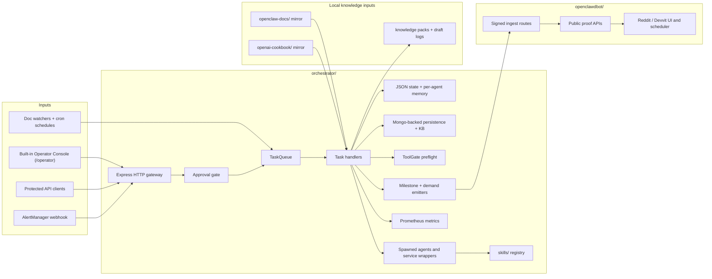

# OpenClaw

OpenClaw is a self-hosted AI operations workspace built around two distinct runtime surfaces:

- a private control plane in `orchestrator/`
- a public proof surface in `openclawdbot/`

The control plane accepts work, routes it across an agent catalog, applies approval and policy checks, records state, and exposes operator APIs. The proof surface receives signed milestones and demand summaries and publishes a community-readable view of system activity without exposing the internal runtime, prompts, or secrets.

This repository is not a conventional single web app. It contains:

- task orchestration and execution logic
- manifest-driven agents and long-running service loops
- a protected operator API and built-in operator console
- signed proof delivery into a separate public surface
- mirrored documentation corpora used as runtime knowledge inputs
- governance, safety, security, and operations runbooks

## What OpenClaw Is

OpenClaw is an orchestrator-first system for bounded AI operations. The orchestrator is the system of record: it owns HTTP ingress, task intake, queueing, approvals, execution history, health, and operator visibility. Agents are task specialists that the orchestrator can spawn as workers or, when explicitly enabled, run as direct service loops. `openclawdbot` is a separate trust boundary that exposes a public proof API and Reddit / Devvit views based on signed inputs from the orchestrator.

The repository exists to solve a specific operational problem: run AI-assisted workflows with durable state and explicit governance while keeping public visibility separate from the internal control plane.

## Core Concepts

- **Orchestrator**: the Express-based control plane in `orchestrator/src/`. It owns task routing, approvals, auth, metrics, health, persistence hooks, and the built-in operator console.
- **Tasks**: allowlisted work items such as `drift-repair`, `reddit-response`, `build-refactor`, `security-audit`, `heartbeat`, and `agent-deploy`. Task types are validated at the API layer and again at queue entry.
- **Task Queue**: an in-process `p-queue` with bounded concurrency, retry metadata, idempotency handling, and run tracking.
- **Agents**: specialized directories under `agents/` with `agent.config.json`, `src/index.ts`, and usually `src/service.ts`. The orchestrator typically runs agents by spawning their worker entrypoint with JSON payload files and reading a JSON result file back.
- **Skills**: bounded capabilities in `skills/` such as `sourceFetch`, `documentParser`, `normalizer`, `workspacePatch`, and `testRunner`.
- **ToolGate**: a real preflight and audit surface for agent-to-skill intent. It validates declared permission use and records attempts. It is not host-level sandboxing.
- **SkillAudit**: a governance review layer for skill bootstrap and governed skill intake. It is not universal runtime containment for every skill invocation.
- **Approvals**: persisted review records used to gate selected task types such as `build-refactor`, `agent-deploy`, and review-sensitive Reddit work.
- **Knowledge Packs**: generated artifacts derived from local mirrored docs and used by downstream tasks such as `reddit-helper`.
- **Public Proof**: signed milestone and demand-summary delivery from the orchestrator to `openclawdbot`, which then exposes read-only public APIs and Reddit-facing views.

## User Roles

- **Operator**: triggers tasks, reviews approvals, monitors health, and uses the protected APIs and `/operator` console.
- **Developer / Builder**: modifies orchestrator code, agents, skills, or proof surfaces and is expected to keep docs aligned with code.
- **Agent Author**: maintains an agent manifest, task contract, worker implementation, and optional service loop.
- **System Admin**: manages `.env`, systemd or compose deployment, MongoDB, metrics, tunnels, and host lifecycle.
- **Community Viewer**: consumes the public proof surface exposed by `openclawdbot`; this role does not access the control plane.

## System Architecture

OpenClaw has a split topology. The orchestrator is the private control plane and state owner. `openclawdbot` is the public proof boundary. Mirrored documentation corpora feed knowledge-driven tasks on the private side, while signed summaries cross the boundary into the proof surface.



## Core Execution Flow

1. Work enters through one of four real paths: the protected task API (`POST /api/tasks/trigger`), doc watchers, cron jobs, or the AlertManager webhook.
2. Requests pass request-size checks, JSON parsing, auth and RBAC where required, rate limiting, and Zod validation.
3. `TaskQueue.enqueue()` validates the task type again, assigns idempotency and attempt metadata, and queues the work in the in-process queue.
4. When execution begins, the orchestrator checks whether the task needs approval. If approval is required, the run is persisted as pending and execution stops until an operator decides it.
5. The resolved handler runs either inline or through a spawned worker path. Most worker tasks execute by spawning `agents/<agent>/src/index.ts` with a temporary JSON payload and an injected result-file path.
6. ToolGate preflight runs before worker launch to validate manifest-declared agent and skill intent.
7. Results are written into the main JSON state file (`orchestrator_state.json`), per-agent service state files, logs, JSONL artifacts, and, on the full boot path, Mongo-backed persistence and knowledge storage.
8. The orchestrator emits signed milestone and demand-summary envelopes to `openclawdbot`, tracking retries and dead-letter state in orchestrator state.
9. `openclawdbot` verifies HMAC signatures, stores proof state, and exposes read-only proof APIs plus Reddit / Devvit views.
10. Operators and other internal clients read outcomes back through `/api/tasks/runs`, `/api/tasks/runs/:runId`, dashboard and health APIs, memory and knowledge endpoints, and the built-in `/operator` console. Public viewers read the separate proof APIs served by `openclawdbot`.

## Repository Structure

- `orchestrator/`: the private control plane. Express server, task queue, handlers, auth, approvals, metrics, persistence, knowledge integration, and the built-in operator UI.
- `agents/`: the agent catalog. Each agent declares task bindings, permissions, model tier, state files, worker entrypoints, and usually a long-running service loop.
- `skills/`: bounded skill definitions and executors used by spawned agents.
- `openclawdbot/`: the public proof surface. Hono server, Devvit app, React client, signed ingest routes, and standalone proof runtime.
- `docs/`: workspace documentation and runbooks.
- `governance/`: policy and invariant docs. Useful context, but not every file reflects current runtime truth.
- `security/`: threat-model and trust-boundary docs.
- `systemd/`: current host service units for this workspace.
- `openclaw-docs/`: in-repo OpenClaw docs mirror used as a default runtime knowledge input.
- `openai-cookbook/`: optional local OpenAI Cookbook mirror. The default sync keeps a curated text, code, and config clue baseline; a broader full mirror is opt-in.
- `logs/`: generated artifacts, drafts, digests, audits, knowledge packs, and snapshots.
- `operations/`: higher-level operational boundaries and runbooks.
- `orchestrator_config.json`: workspace-level runtime paths and behavior for the control plane.
- `orchestrator_state.json`: durable JSON control-plane state.

## Tech Stack

- **Languages**: TypeScript, JavaScript, Markdown, JSON, Bash.
- **Runtime**: Node.js 22+ is the practical baseline. The current host systemd units pin Node from an nvm-managed Node 24.12.0 install.
- **Control plane backend**: Express, `p-queue`, `node-cron`, `chokidar`, `zod`.
- **Public proof backend**: Hono on `@hono/node-server`, Devvit `@devvit/web/server`.
- **Frontends**:
  - built-in operator console: plain HTML, CSS, and browser JavaScript served from `orchestrator/src/operator-ui/`
  - public proof UI: React 19 + Vite + Tailwind CSS 4 inside `openclawdbot`
- **Persistence**:
  - primary control-plane state: JSON in `orchestrator_state.json`
  - per-agent memory and service state: JSON files referenced by each manifest
  - draft and proof artifacts: JSON and JSONL in `logs/`
  - extended persistence and knowledge storage: MongoDB
- **Observability**: `prom-client`, Prometheus, Grafana, Alertmanager.
- **AI/model layer**:
  - direct runtime client use is present for OpenAI in `agents/reddit-helper`
  - agent manifests declare model tiers and preferences
  - Anthropic keys are plumbed through config and child-process env, but there is no direct Anthropic SDK integration in the current control-plane runtime
- **Knowledge mirrors**:
  - `openclaw-docs/` is intended to ship in-repo
  - `openai-cookbook/` is runtime-optional and should default to a curated text-and-clues mirror; full upstream sync is available explicitly
- **Deployment**: systemd units and Docker Compose.
- **Deferred infrastructure**: Redis / Valkey is configured and documented, but it is not an active coordination dependency in the current orchestrator runtime path.

## Operator Console

The repository includes a built-in operator console served by the orchestrator at `/operator`. It is not a separate SPA repository.

Current tabs:

- `Overview`
- `Tasks`
- `Approvals`
- `Agents`
- `Governance`
- `System Health`
- `Activity`
- `Knowledge`

What the console does today:

- stores a bearer token and proof URL in browser local storage
- calls protected orchestrator APIs directly
- triggers tasks through `POST /api/tasks/trigger`
- reviews approvals through `/api/approvals/*`
- displays task catalog exposure metadata rather than exposing every task blindly
- shows agent declaration, worker, and service-operational state
- separates shallow `/health` from authoritative `/api/health/extended`
- queries the knowledge layer through `/api/knowledge/query`

There is also an externally hosted Lovable preview URL referenced in config for CORS allowlisting, but that frontend source is not in this repository. The source-controlled operator UI in this repo is the built-in `/operator` shell.

## Agent Runtime

The agent layer is manifest-driven.

Each agent directory typically contains:

- `agent.config.json`
- `src/index.ts` for task execution
- `src/service.ts` for direct service mode
- local runbooks such as `README.md`, `ROLE.md`, `SCOPE.md`, `POLICY.md`

How agents run:

- The orchestrator spawns most workers through `tsx`, pointing at `src/index.ts`.
- Payloads are passed through temporary JSON files.
- Results are read back from JSON files whose paths are injected through environment variables such as `REDDIT_HELPER_RESULT_FILE`.
- Spawned child processes receive an allowlisted environment rather than the full parent environment.
- Per-agent service memory is persisted to the manifest-defined `serviceStatePath`.

Direct service mode is also real:

- `doc-specialist` and `reddit-helper` have meaningful service loops
- all declared runtime agents now have `src/service.ts`
- direct service execution is gated by `ALLOW_DIRECT_SERVICE=true`
- direct task execution is gated by `ALLOW_ORCHESTRATOR_TASK_RUN=true`, with `ALLOW_DIRECT_TASK_RUN=true` as an explicit break-glass override

Important boundary: agent manifests, ToolGate, and skill definitions constrain intent, but they do not provide container-grade sandboxing. This is a governed multi-process workspace, not a hardened untrusted code-execution platform.

## Governance and Safety

### Enforced Today

- task types are deny-by-default and validated at both the API layer and queue layer
- protected orchestrator APIs require bearer auth
- RBAC is server-side with `viewer`, `operator`, and `admin` roles
- protected routes are rate-limited by role bucket
- protected actions are audit-logged with request ID, actor, role, and outcome
- AlertManager ingress uses HMAC verification
- approval-gated tasks are persisted and replayed only after approval
- state retention is bounded in `state.ts`
- orchestrator CORS is deny-by-default with an explicit origin allowlist
- spawned worker environments are allowlisted
- `openclawdbot` internal mutating routes are Devvit-context-gated
- `openclawdbot` signed ingest requires HMAC headers and a shared signing secret
- `openclawdbot` public `/api/*` routes intentionally serve read-only CORS headers for cross-origin `GET` and `OPTIONS`

### Partial or Deferred

- ToolGate is a real preflight and audit layer, but not a runtime sandbox
- SkillAudit runs during skill bootstrap and governed intake, not as universal per-invocation containment
- governed skill APIs are visibility surfaces today, not a general self-extension runtime
- Redis / Valkey is configured as future coordination infrastructure but is not an active orchestrator runtime dependency
- long-running agent services can bypass orchestrator-first dispatch if an operator chooses to run them directly
- some docs under `governance/`, `security/`, and `operations/` describe older gaps or proposed baselines rather than current code truth

## API Surface

### Orchestrator Public Routes

- `GET /operator`
- `GET /health`
- `GET /api/openapi.json`
- `GET /api/knowledge/summary`
- `GET /api/persistence/health`

### Orchestrator Protected Routes

- `GET /api/auth/me`
- `GET /api/tasks/catalog`
- `POST /api/tasks/trigger`
- `GET /api/tasks/runs`
- `GET /api/tasks/runs/:runId`
- `GET /api/approvals/pending`
- `POST /api/approvals/:id/decision`
- `GET /api/dashboard/overview`
- `GET /api/agents/overview`
- `GET /api/health/extended`
- `GET /api/memory/recall`
- `POST /api/knowledge/query`
- `GET /api/knowledge/export`
- `GET /api/persistence/historical`
- `GET /api/persistence/summary`
- `GET /api/persistence/export`
- `GET /api/skills/registry`
- `GET /api/skills/policy`
- `GET /api/skills/telemetry`
- `GET /api/skills/audit`

### Orchestrator Webhook

- `POST /webhook/alerts`

### `openclawdbot` Public Proof Routes

- `GET /api/command-center/overview`
- `GET /api/command-center/control`
- `GET /api/command-center/demand`
- `GET /api/command-center/demand-live`
- `GET /api/milestones/latest`
- `GET /api/milestones/dead-letter`

### `openclawdbot` Internal Routes

- `POST /internal/milestones/ingest`
- `POST /internal/demand/ingest`
- Devvit-context-gated mutators under:
  - `/internal/menu/*`
  - `/internal/form/*`
  - `/internal/triggers/*`
  - `/internal/scheduler/*`

The generated OpenAPI document in `orchestrator/src/openapi.ts` is useful as a route inventory, but it is not yet a complete schema-rich contract for the whole system.

## Current Project Status

### Implemented and Wired

- orchestrator-first task intake, queueing, and handler dispatch
- approval-aware task replay
- built-in operator console
- per-run execution history and per-agent memory recall
- Mongo-backed persistence and knowledge-base integration on the full boot path
- Prometheus metrics export and the compose-level observability stack
- doc mirror indexing and knowledge-pack generation
- signed milestone delivery from the orchestrator to `openclawdbot`
- signed demand-summary delivery from the orchestrator to `openclawdbot`
- standalone `openclawdbot` proof service on `WEBBIT_PORT`
- public proof APIs and Reddit / Devvit UI surfaces

### Implemented but Still Partial

- ToolGate: preflight and audit only, not sandboxed execution
- SkillAudit: registration-time governance surface, not universal runtime enforcement
- governed skills: persisted metadata and read-only operator APIs, but not a full self-extension runtime
- agent service mode: real and host-deployable, but not automatically governed by the orchestrator unless operators enforce that operationally
- OpenAPI coverage: route inventory is present, request and response schema detail is still thin
- documentation: active anchors are strong, but the repo still contains stale or historical docs that must be treated carefully

### Documented or Planned but Not Yet Proven as Core Runtime

- Redis / Valkey as an active coordination layer for claims, locks, and shared budgets
- exhaustive milestone coverage for every important runtime event
- fully schema-rich operator API contracts
- broad Reddit publish and review availability for the Devvit app

## Getting Started

### Prerequisites

- Node.js 22+
- npm
- MongoDB if you want the full non-fast-start orchestrator path
- Devvit CLI only if you intend to deploy the Reddit app

### Install Dependencies

```bash
npm install
cd orchestrator && npm install
cd ../openclawdbot && npm install
```

### Sync Local Knowledge Mirrors

If `openclaw-docs/` or `openai-cookbook/` are missing or stale:

```bash
./sync_docs_sources.sh
```

That default keeps `openclaw-docs/` current and refreshes a curated text,
code, and config OpenAI Cookbook mirror. If you explicitly want the broader
upstream cookbook mirror for local exploration, run:

```bash
./sync_docs_sources.sh --mode=full
```

The `--mode=full` path is for local enrichment only; the committed repository
baseline is intentionally smaller.

### Prepare Environment

```bash
cd orchestrator
cp .env.example .env
```

At minimum, set:

- `API_KEY_ROTATION` or `API_KEY`
- `WEBHOOK_SECRET`
- `DATABASE_URL`
- `MONGO_USERNAME`
- `MONGO_PASSWORD`
- `REDIS_PASSWORD`
- `OPENAI_API_KEY`
- `MILESTONE_SIGNING_SECRET`

## Configuration

### `orchestrator_config.json`

Controls workspace paths and runtime behavior, including:

- required OpenClaw docs root and optional cookbook mirror root
- log and state paths
- approval-required task types
- knowledge pack and digest output locations
- CORS allowlists for external frontends
- signed milestone and demand-summary ingest targets

### `orchestrator/.env`

Controls secrets and deployment behavior, including:

- API authentication and key rotation
- webhook signing secret
- MongoDB connection
- provider keys
- metrics and alerting settings
- CORS overrides

### `agents/*/agent.config.json`

Controls per-agent:

- task binding
- skill permissions
- filesystem and network bounds
- model tier and runtime constraints
- per-agent state and service-state paths

### `openclawdbot` Runtime Configuration

Key runtime knobs:

- `WEBBIT_PORT`
- `MILESTONE_SIGNING_SECRET`
- `OPENCLAWDBOT_STATE_PATH`

`MILESTONE_SIGNING_SECRET` must match on both sides of the orchestrator-to-proof boundary.

## Running the System

### Local Orchestrator Dev Path

Quick, degraded boot:

```bash
cd orchestrator
ORCHESTRATOR_FAST_START=true PORT=3312 npm run dev
```

This skips the full persistence, memory scheduler, and knowledge-integration startup path, but still boots the API server, doc indexers, and cron routes.

### Full Local / Host-Like Path

Start `openclawdbot` first:

```bash
cd openclawdbot
npm run build
WEBBIT_PORT=3310 MILESTONE_SIGNING_SECRET=... node dist/server/index.cjs
```

Then start the orchestrator:

```bash
cd orchestrator
npm run build
PORT=3312 node --env-file=.env dist/index.js
```

Useful checks:

```bash
curl http://127.0.0.1:3312/health
curl http://127.0.0.1:3310/api/command-center/overview
curl http://127.0.0.1:9100/metrics
```

The metrics server defaults to `9100` unless `PROMETHEUS_PORT` is overridden.

### Canonical Host Deployment

The repository currently treats systemd as the canonical host runtime:

- `systemd/orchestrator.service`
- `systemd/openclawdbot.service`
- `systemd/cloudflared-openclawdbot.service`

On the current host these units run:

- orchestrator on `3312`
- `openclawdbot` on `3310`

They are intentionally coupled in this workspace:

- `orchestrator.service` has `Wants=openclawdbot.service cloudflared-openclawdbot.service`
- `openclawdbot.service` has `PartOf=orchestrator.service` and `BindsTo=orchestrator.service`
- `cloudflared-openclawdbot.service` binds to `openclawdbot.service` and reads
  `OPENCLAWDBOT_TUNNEL_TOKEN` from `orchestrator/.env`

That means starting the orchestrator is expected to bring up `openclawdbot`, and stopping the orchestrator will also stop the proof service.

The systemd units in this repo are workspace-specific and use absolute paths. Adapt them before using this repository on another host.

### Docker Compose

Primary integrated stack:

```bash
cd orchestrator
cp .env.example .env
docker-compose up -d --build
```

This brings up:

- orchestrator
- MongoDB
- Redis
- Prometheus
- Grafana
- Alertmanager

It does **not** include `openclawdbot`.

Compose defaults the orchestrator API to `3000` unless you override `PORT`. The
current production-style systemd path in this workspace uses `3312` instead.

Compose requirements:

- create `orchestrator/.env` first; the compose stacks rely on it for
  `API_KEY_ROTATION`/`API_KEY`, `WEBHOOK_SECRET`, `MONGO_USERNAME`,
  `MONGO_PASSWORD`, and `REDIS_PASSWORD`
- the container image is workspace-aware, so spawned agents and local
  knowledge roots are available inside the container instead of degrading to an
  orchestrator-only image
- the root `docker-compose.yml` is the minimal fast-start mode
- `orchestrator/docker-compose.yml` is the full dependency stack mode
- the full dependency stack mode forces the orchestrator container onto the
  local `mongo` service even if your host `.env` outside Docker points at an
  external database
- the host `systemd` path now expects local open-source Redis on
  `127.0.0.1:6379` through `systemd/openclaw-redis.service`; this is a
  Docker-backed local Redis service, not a paid hosted dependency
- existing Docker volumes are not downgrade-safe; if you already have local
  MongoDB or Redis data from newer images, keep the compose image versions
  compatible or reset those volumes before expecting a clean boot

The root `docker-compose.yml` exists, but it is a legacy and minimal path, not the primary integrated deployment model.

## Documentation Map

Source-of-truth order for implementation work:

1. active runtime code and live config
2. `../OPENCLAW_CONTEXT_ANCHOR.md` when present in the surrounding workspace
3. this `README.md`
4. the current docs hub and runbooks

### GitHub Navigation Tabs

- **Overview**: `README.md`
- **Quick Start**: `QUICKSTART.md`
- **Architecture**: `docs/OPENCLAW_KB/ARCHITECTURE.md`
- **Docs Hub**: `docs/README.md`
- **Operations**: `docs/operations/SPRINT_TO_COMPLETION.md`
- **Milestones + Proof**:
  - `docs/CLAWDBOT_MILESTONES.md`
  - `docs/operations/MILESTONE_INGEST_CONTRACT.md`
  - `docs/operations/MILESTONE_PIPELINE_RUNBOOK.md`
  - `docs/operations/clawdbot-milestone-delivery-plan.md`
- **Governance + Security**:
  - `governance/RUNTIME_GOVERNANCE.md`
  - `security/TRUST_BOUNDARIES_AND_THREATS.md`
  - `operations/RUNBOOK_BOUNDARIES.md`

Recommended starting points:

- `docs/README.md`
- `docs/operations/SPRINT_TO_COMPLETION.md`
- `docs/operations/orchestrator-status.md`
- `agents/README.md`
- `openclawdbot/README.md`

## Contributing

- Treat runtime code and active config as the final authority.
- Do not create competing truth layers when an existing canonical doc can be updated.
- Update relevant existing `.md` files in the same change set when code or config changes materially.
- Keep agent manifests, task types, and API docs aligned.
- Run the repo checks that reflect current practice:

```bash
bash scripts/check-doc-drift.sh
cd orchestrator && npm run build && npm run test:unit:fixtures && npm run test:integration
cd ../openclawdbot && npm run type-check && npm run build && npm run test
```

## License

No top-level workspace license file is present today.

Subprojects currently carry their own licensing:

- `openclawdbot/` declares `BSD-3-Clause`
- `openai-cookbook/` carries its upstream license

Treat the workspace as mixed-license until a root license is added.
